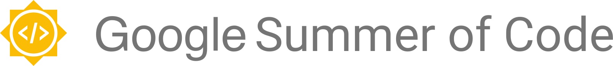
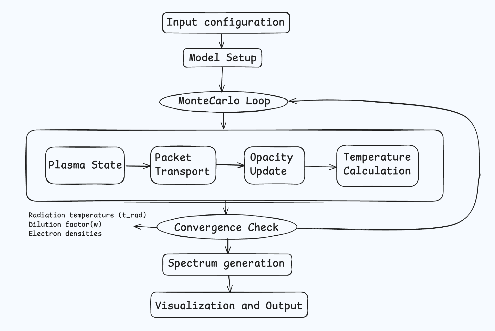

GSoC'25 Proposal - TARDIS RT Collaboration

<!-- <div style="display: flex"> -->
 
<!-- </div> -->

# Adding HDF Writing Capabilities to TARDIS Modules

## Project Details

- Organization : [TARDIS RT Collaboration](https://github.com/tardis-sn)
- Project Title : [Adding HDF Writing Capabilities to TARDIS Modules](https://tardis-sn.github.io/summer_of_code/ideas/#adding-hdf-writing-capabilities-to-tardis-modules)

- Mentors : [Andrew Fullard](https://github.com/andrewfullard), [Atharva Arya](https://github.com/atharva-2001), [Abhinav Ohri](https://github.com/KasukabeDefenceForce)

- Difficulty : HARD

## Personal Information

Name : Karthik Rishinarada

Email : karthikrk11135@gmail.com

LinkedIn: [Karthik Rishinarada](https://www.linkedin.com/in/karthik-rishinarada-a61b39251/)

Github id : [karthik11135](https://github.com/karthik11135)

Brief Summary : I'm a senior-year college student from NIT Trichy, India. I interned at Capital One, where I worked with a Python team. Over the past few months, I have developed an interest in open source and started exploring open-source codebases. I enjoy listening to music, window shopping, and planning vacations.

Resume : [Link to my Resume](https://drive.google.com/file/d/1LTs82Yv-aLM0iVrQHyoPOCQsfxLe_wFC/view?usp=sharing)

## <u>About the Organisation</u>

TARDIS (Temperature And Radiative Diffusion In Supernovae) is an open-source radiative transfer code that is developed for simulating supernova spectra. TARDIS helps astrophysicsts understand how exploding stars appear to observers by creating synthetic spectra - essentially predicting what these star explosions would look like through a telescope. Rather than taking days or weeks to simulate a spectrum, TARDIS uses real approximations to generate while maintaining accuracy.

<u>Core Components of TARDIS</u>
| **Components** | **Description** |
|-------------------------------------|------------------------------------------------------------------|
| **Configuration & Input** | <ul><li>Handles model parameters, atomic data, and abundance configurations (YAML or HDF).</li></ul> |
| **Physical Model Setup** | <ul><li>Establishes the radial grid structure (ex: Radial 1D Geometry) and initial conditions.</li><li>Contains density profiles and abundance distributions across shells.</li></ul> |
| **Monte Carlo Radiation Transport** | <ul><li>Implements core Monte Carlo setup for packet propagation through shells.</li><li>Handles packet interactions including scattering, absorption, and re-emission.</li></ul> |
| **Plasma Physics** | <ul><li>Calculates ionization states and level populations.</li><li>Handles atomic transitions and electron density calculations.</li></ul> |
| **Opacity Calculation** | <ul><li>Computes line and continuum opacities for each shell.</li>
| **Monte Carlo Iteration Handler** | <ul><li>Controls the main iteration loop for temperature convergence. Once the convergence happens the data is used to update plasma properties</li></ul> |
| **Spectrum Synthesis** | <ul><li>Collects energy packets into observable spectra.</li>

<u> Flow Diagram </u>


## Project Summary

---

## First Objective Task
Task : Add a method to the spectrum class that allows restoring the class from an HDF. Share the notebook in a pull request.

Link to solution : [GSOC PR](https://github.com/tardis-sn/tardis/pull/2995)

Explanation : from_hdf method is created on the TARDISSpectrum class to retrieve all the data from the hdf file and store as an object. The two main options that are required to initialize the spectrum class are the frequencies and luminosities. In the HDF file they are stored in the paths ```'/tardis_spectrum/_frequency'``` and ```'/tardis_spectrum/luminosity'``` respectively`. The data reciding in these paths is retrieved and the class is created.  


---

## My Approach towards the project

---

## Milestones


---

### Why I've chosen TARDIS?

Over the past few months I wanted to explore open-source contributions. So I started looking for python repositories on GitHub. That’s when I came across TARDIS.

I've gone through the entire codebase and gained an understanding of its main components. While going through the code, I encountered numerous scientific terms like Monte Carlo Iteration, Plasma State, JBlues etc. I really enjoyed the process of googling these terms and understanding them. The documentation was written in a very clear way. The clarity of explanations in the documentation made it easier to understand the code. These are the two primary things that made me stick to contributing to TARDIS.

---

### Why am I the best fit?

My first internship offer was from a fintech company — Capital One, where I worked as a Software Developer Intern for two months. During this time, I improved my Python programming skills, which is the primary language used in TARDIS. I improved the runtime of our codebase by 40%. After my internship, I discovered TARDIS and began exploring its code by studying the documentation and working through the quickstart tutorials. I've gone threw few issues in the codebase and tried to solve a few of them.

Main Tardis repo:

- [add test to line info](https://github.com/tardis-sn/tardis/pull/2947)
- [from Simulation test for RPacket Plot](https://github.com/tardis-sn/tardis/pull/2945)
- [TODO: Tests of Composition](https://github.com/tardis-sn/tardis/pull/2944)
- [TODO: Rename tau to tau_event](https://github.com/tardis-sn/tardis/pull/2931)
- [Tests for config validator](https://github.com/tardis-sn/tardis/pull/2926)
- [refactor: Remove ConfigWriterMixin class](https://github.com/tardis-sn/tardis/pull/2926)

Regression Data repo:

- [Regression data for Composition](https://github.com/tardis-sn/tardis-regression-data/pull/44)

Carsus repo:

- [fixes NISTWeightsComp initialization error](https://github.com/tardis-sn/carsus/pull/436)

Apart from this, I actively explore new technologies and work on personal projects to enhance my skills. I believe that I am a perfect fit for this project because I've a good grip on the codebase and I understand what happens under the hood. I also believe that I can hit the ground running from day 0.

---

### Conclusion

In conclusion, my strong knowledge in Python, experience with open-source contributions, and familiarity with the TARDIS codebase make me a great fit for this project. While I have exams from May 3rd to May 9th, I will be entirely free afterward and fully committed to executing the project. I look forward to contribute meaningfully to the TARDIS RT Collaboration.
